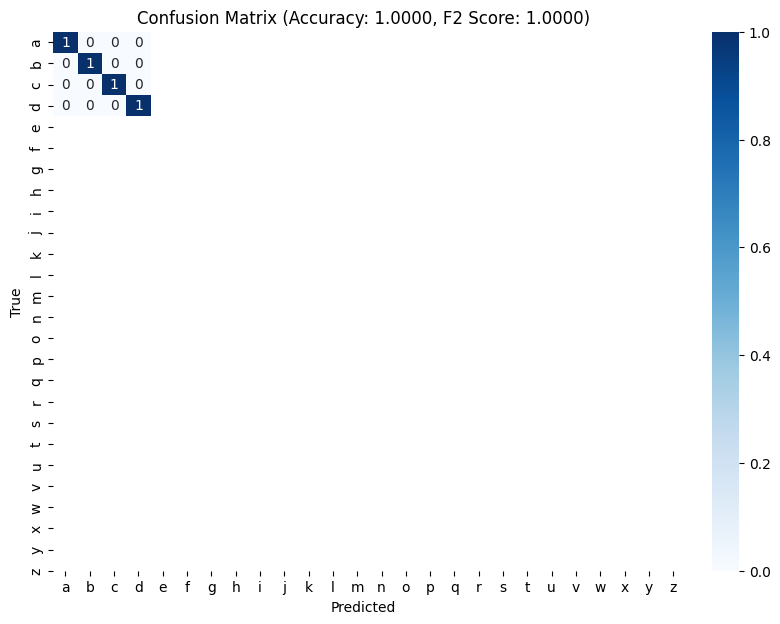

# ProbeLens
### A framework to enable probing of language models.


## API
### Example Usage

Here is an example of how to use the ProbeLens framework to generate probe data and train a linear probe on a spelling task:


#### Configure probe experiment
We use the `FirstLetterSpelling` experiment as an example. With the `FirstLetterSpelling` class, we see how well the model's activations encode the first letter of the word.
```python
from probe_lens.experiments.spelling import FirstLetterSpelling

words = ["example", "words", "to", "spell"]
spelling_task = FirstLetterSpelling(words)
```

#### Configure hooked transformer model and SAE
We use the `HookedSAETransformer` class from `sae_lens` to hook the transformer model and the `SAE` class to get the SAE. This package is designed to be tightly integrated with `sae_lens` and `transformer_lens`.
```python
from sae_lens import HookedSAETransformer, SAE
DEVICE = "mps"
model = HookedSAETransformer.from_pretrained_no_processing("gpt2-small", device=DEVICE)
sae, cfg_dict, sparsity = SAE.from_pretrained(
    release="gpt2-small-res-jb",  # see other options in sae_lens/pretrained_saes.yaml
    sae_id="blocks.8.hook_resid_pre",  # won't always be a hook point
    device=DEVICE,
)
```

#### Generate probe data
We use the `generate_probe_data` method to generate the probe data. This involves the querying the model with various prompts and capturing the activations.
```python
from torch.utils.data import DataLoader
dataset = spelling_task.generate_probe_data(model, sae, device=DEVICE)
dataloader = DataLoader(dataset, batch_size=2, shuffle=True)
```

#### Initialize probe
We initialize a linear probe with the same number of outputs as classes in the experiment.
```python
from probe_lens.probes import LinearProbe
X, y = next(iter(dataloader))
probe = LinearProbe(X.shape[1], y.shape[1], class_names=spelling_task.get_classes(), device=DEVICE)
```

#### Train probe
We use stochastic gradient descent to train the probe.
```python
import torch.optim as optim
probe.train_probe(dataloader, optim.SGD(probe.parameters(), lr=0.01), val_dataloader=None, epochs=1000)
```

#### Visualize performance
We use the `visualize_performance` method to visualize the performance of the probe.
```python
plot = probe.visualize_performance(dataloader)
```



## Roadmap
### Functionalities
- [x] Add basic linear probe with tests
- [ ] Add regularization
- [ ] Add sparsity
- [ ] Add other kind of probes
    - [ ] Non-linear probes
    - [ ] ... ?

### Applications
- [ ] Reproduce results from SAE-Spelling
    - [ ] First letter data generation
- [ ] Add more probing experiments
    - [ ] ... ?

### Visualization
- [x] Add Confusion Matrix 
- [x] Add f2 score and accuracy
- [ ] Add more visualization experiments
    - [ ] ... ?

### Documentation
- [ ] Add docstrings
- [ ] Add tutorials
- [ ] Reproduce experiments from major papers (SAE-Spelling, etc.)

